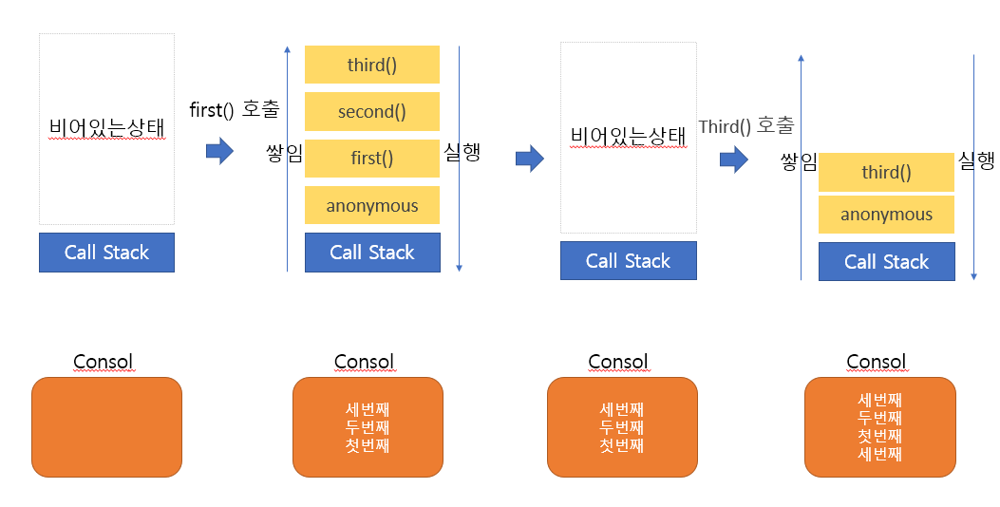

# JS 의 Event Loop (이벤트 루프)

## 1.개요
자바스크립트는 **비동기 / 동시성**을 어떻게 처리할까요 ? 

자바스크립트는 태생적으로 <strong style="color:tomato">단일스레드</strong> 기반의 언어로 이루어진 대표적인 언어 입니다.  스레드가 하나라는 말은 곧 절자치향적으로 동시에 하나의 작업만을 처리할 수 있다는 이야기인데 어떻게 Node.js 기반에서 또는 브라우저에서 동시적인 처리들이 일어날 수 있는 것일까요?

이러한 자바스크립트에서 동시성을 처리할 수 있는 개념이 바로 <strong style="color:tomato">이벤트루프(Event loop)</strong> 입니다.

Node.js를 소개할 때 가장 많이 쓰이는 인용구중에 _<strong style="color:gray">"이벤트 루프 기반의 비동기 방식으로 Non-Blocking IO를 지원하고.."</strong>_ 라는 인용구들을 볼수 잇는데 동작 원리 를 이해하는건 매우 중요한 일 입니다. 

 

## 2.단일쓰레드 JS는 어떻게 비동기를 처리하는가.
개요에서 살펴봤듯이 브라우저와 Node 기반에서 이벤트루프 개념은 상당히 중요해 보입니다. 하지만 자바스크립트 공식 스펙 <strong style="color:tomato">ECMAScript</strong> 에서 이벤트 루프에 대한 내용이 없습니다. 

실제로 가장유명한 자바스크립트 엔진 V8 엔진은 단일 호출 스택(Call Stack)을 사용하여 요청이 들어올 때마다 해당 요청을 스택에 담아 처리할 뿐입니다. 여기까지의 내용을 들었을때는 정말 이상하죠 분명 Javascript 기반의 어플리케이션을 사용할때 동시성 기능들을 사용하고 있는데 말이죠.. 

이러한 동시성에대한 처리는 정확하게 말하자면 자바스크립트 엔진에서 처리하는것이 아니라 브라우저나 Node.js 환경이 담당합니다. 아래 개념도를 살펴보시죠

**[Browser 구성개념도]**

**[Node 구성개념도]**

위의 개념도를 비교해 보았을때 Task Queue 의 부분과 LIBUV 부분이 비슷하다고 이해하셔도 좋습니다. 

여기서 너무너무도 중요하기 때문에 다시 한번 정리하자면 **JavaScript엔진 자체는 단일스레드로 단일 호출 스택을 사용한다는 것은 사실이지만 범용적인 용어 브라우저에서의 Javascript 또는 Node 에서의 자바스크립트는 Browser+Javascript, Node+javascript 관점으로 Javascript를 말한다면 단일스레드가 아닌 것 입니다.**

 

## 3.Why Study Event loop (이벤트루프를 공부하는 이유)
정말 개념이 어렵습니다. 그렇다면 왜 이벤트 루프를 공부해야할까요... 안하면 안될까요? 정답은 안하면 안된다 입니다. ~~정말 공부할꺼 많아요 ㅠ~~ 그럼 그 이유는 무엇일까요 코딩을 하다보면 동시성/비동기성 프로그래밍을 해야할 부분들이 많이 발생하는데 원리를 이해하지 못하면 코드의 실행순서를 파악하지 못하기 때문입니다. 
아직까지도 와 닿지 않으신 분들을 위해서 코드로 왜 이벤트 루프를 학습해야하는지 알아보겠습니다. 

 

## 4.코드로 알아보는 이벤트 루프
가장먼저 Javascript 엔진영역의 call stack 에대해서 알아보겠습니다.

~~~js
//file: `call stack 파악하기`
function first() {
  second();
  console.log('첫 번째');
}
function second() {
  third();
  console.log('두 번째');
}
function third() {
  console.log('세 번째');
}
first(); // A호출이라 칭함
third(); // B호출이라 칭함
~~~

위의 소스 의 출력 결과물을 예상해 봅시다. 

어려우시다고요?? 걱정하지마세요.
먼저 정확한 이해를 돕기위해 Stack 이란 무엇인지 알아볼 필요가 있습니다. 
<strong style="color:tomato">Stack 이란 한쪽 끝에서만 자료를 넣거나 뺄 수 있는 선형구조로(LIFO) 되어있는 자료구조</strong>라고 생각 하시면 되겠습니다. 이는 추후에 상세히 포스팅할 예정이며 지금은 그냥 프링글스 통안에 감자칩을 생각하면 쉽습니다. 통 맨 밑에 먼저 넣은 감자칩이고 나중에 넣은 감자칩이 제일먼저 입속으로 들어가겠죠? Javascript는 함수가 호출되면 콜스택에 순차적으로 쌓이고 콜스택에 다 쌓였으면 나중에 쌓인 함수부터 실행되는 형태를 가지고 있습니다.

**[Call Stack 예제 결과]**

위의 그림과 같이 함수가 쌓이고 비워지면 다음 함수를 호출하고 쌓이고 실행하고를 반복하는 구조입니다. ~~여기서 console.log 는 콜스택 그림에 포함하지 않았습니다.~~
이제 감이 잡히시죠 이렇게 순차적으로 동작되면 아무런 고민도 하지 않고 행복할껏만 같습니다.
하지만 세상일은 뜻대로 되지 않죠 어떠한 함수만 지연로딩이라던지 시간적으로 동시에 돌아가야하는 상황들이 발생될때에는 어떻게 동작이 될까요 이벤트루프에대해서 예제로 이해해 봅시다.

~~~js
//file: `event loop 동작 파악하기`
function run() {
  console.log('동작');
}
console.log('시작');
setTimeout(run, 3000);
console.log('끝');
~~~

위의 함수를 실행 했을때의 결과를 예측해보세요 조금만 생각해보면 결과는 쉽습니다. 
시작,끝 그리고 3초뒤에 동작이라는 문자열이 콘솔에 찍힙니다. 여기에서 의문점은 콜스택에서 비워지지 않은 상태에서 끝이 먼저 호출된것이 의문스럽긴 하지만 일단 다음 코드를 살펴봅시다. 

~~~js
//file: `event loop 동작 파악하기2`
function run() {
  console.log('동작');
}
console.log('시작');
setTimeout(run, 0);
console.log('끝');
~~~

위의 코드는 어떻게 실행될까요? setTimeout(run, 0); 이니까 시작 동작 끝순서로 console.log 가 찍힐까요? 그렇지 않습니다. 앞서 본 코드와 같이 <strong style="color:tomato">시작 끝 동작 순으로 console.log 가 실행</strong>되는 결과를 보실수 있습니다. 

이상합니다.. 콜스택 개념으로 설명해도 console.log('시작'); 가 담겼다 실행되고 추후에 setTimeout(run, 0); 함수가 담겼다 실행되고 그다음 console.log('끝'); 함수가 담겼다 실행되면 결과는 달라져야하는데 말이죠.

그이유는 setTimeout 함수가 비동기/동시성을 지원하는 함수 이기때문에 가능한 것 입니다. 그렇다면 setTimeout 은 콜스택에 담기지 않는 것일까요? 아닙니다. 콜스택에 담기지만 비동기처리를하는 메모리영역으로 결과값을 넘겨주고 task queue 에 담겨서 이벤트 루프에 의해서 실행됩니다. 

아 어렵죠? 정말 어렵습니다. 낯선 용어들..과 필자의 이해안가는 필력.. 그림으로 이해해 보도록 하죠..

**[Event Loop 도식]**

위의 도식에서 setTimeout() 을 호출하면 Call Stack 에 쌓이고 실행시 메모리공간에 3초후에 실행되라 , 0초후에 실행되라 에 메모리공간(백그라운드) 에 등록한후 그 메모리공간에서 로직이 실행되면  (3초후에, 0초후에) Task Queue 에 등록되게 됩니다.
이벤트루프는 타스크 큐와 Call Stack 의 상태를 감지후에 Call Stack 이 비워진 상태가 되면 Task Queue 에있는 함수를 Call Stack 에 등록 시키는 역할을 한다는 것을 알 수 있습니다. 

 

## 참고사이트
- [https://velog.io/@thms200/](https://velog.io/@thms200/Event-Loop-%EC%9D%B4%EB%B2%A4%ED%8A%B8-%EB%A3%A8%ED%94%84)

- [https://meetup.toast.com](https://meetup.toast.com/posts/89)
- [https://www.zerocho.com](https://www.zerocho.com/category/JavaScript/post/597f34bbb428530018e8e6e2)
- [https://developer.mozilla.org](https://developer.mozilla.org/ko/docs/Web/JavaScript/EventLoop)
