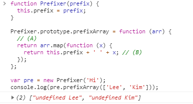
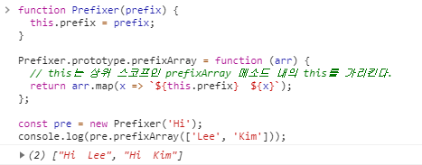

# [JS] ES6 Arrow Function(화살표 함수)


## 1.개요
화살표 함수(Arrow function)는 function 키워드 대신 <b style="color:tomato">화살표(=>)</b>를 사용하여 보다 간략한 방법으로 함수를 선언할 수 있다. 하지만 모든 경우를 화살표 함수로 변형해서 사용할 수 있는 것은 아닐 수 있기 때문에 상황을 고려 해야 합니다.

## 2.화살표 함수의 선언
화살표 함수의 기본문법은 다음과 같습니다. 

```js
// 매개변수 지정 방법
    () => { ... } // 매개변수가 없을 경우
     x => { ... } // 매개변수가 한 개인 경우, 소괄호를 생략할 수 있다.
(x, y) => { ... } // 매개변수가 여러 개인 경우, 소괄호를 생략할 수 없다.

// 함수 몸체 지정 방법
x => { return x * x }  // single line block
x => x * x             // 함수 몸체가 한줄의 구문이라면 중괄호를 생략할 수 있으며 암묵적으로 return된다. 위 표현과 동일하다.

() => { return { a: 1 }; }
() => ({ a: 1 })  // 위 표현과 동일하다. 객체 반환시 소괄호를 사용한다.

() => {           // multi line block.
  const x = 10;
  return x * x;
};
```

전통적인 함수 선언방식에 익숙하신 분들은 위의 선언방식이 다소 생소 할 수 있습니다. 하지만 화살표 함수는 필수적인 요소기 때문에 반드시 학습을 해야 한다고 생각합니다.

## 3.화살표 함수의 호출
선언하는 방법을 살펴 보았으면 이제 호출 하는 방법을 살펴 볼까요?

전통적인 방식과 화살표 함수를 사용해서 하는 방식을 비교해 보겠습니다. 

```js
// ES5
var powEs5 = function (x) { return x * x; };
console.log(powEs5(10)); // 100

// ES6
const powEs6 = x => x * x;
console.log(powEs6(10)); // 100
```

위의 코드에서 동일한 문법을 가지고 함수를 선언하고 호출 해보았는데 무엇이 더 간결한가요? 아직 차이를 못 느끼시겠다고요? <br> 
그럼 다른 예제를 한번 살 펴 보겠습니다.


```js
// ES5
var arrEs5 = [1, 2, 3];
var powEs5 = arrEs5.map(function (x) { // x는 요소값
  return x * x;
});

console.log(powEs5); // [ 1, 4, 9 ]


// ES6
const arr = [1, 2, 3];
const pow = arr.map(x => x * x);

console.log(pow); // [ 1, 4, 9 ]
```
위의 코드는 배열의 값들의 곱을 반환해서 새로운 배열로 만드는 예제입니다. <br>
이제는 확실히 ES6 에서 도입된 화살표 함수가 더 간결하다는 것을 알 수 있겠죠? 

## 4.this
<b style="color:tomato">this</b> 는 매우 중요합니다. 하지만 일반함수와 화살표 함수에서의 <b style="color:tomato">this</b>는 너무나 큰 차이점이 발생하게 됩니다. 

그 이유는 자바스크립트의 <b style="color:tomato">this</b>는 호출 방식에 의해 <b style="color:tomato">this</b>에 바인딩될 객체가 <b style="color:tomato">동적</b>으로 결정되기 때문입니다. 

설명을 이해하기 어렵다면 느낌으로 _<b style="color:tomato">this는 미리선언 되어있는 것이 아니라 호출 시점에 생기는 것</b>_ 이라고 생각하시면 될 것 같습니다.

그럼 이를 이해하기위해 먼저 <b style="color:tomato">일반함수의 this </b> 부터 살펴보겠습니다. 


### 4-1. 일반함수의 this
```js
function Prefixer(prefix) {
  this.prefix = prefix;
}

Prefixer.prototype.prefixArray = function (arr) {
  // (A)
  return arr.map(function (x) {
    return this.prefix + ' ' + x; // (B)
  });
};

var pre = new Prefixer('Hi');
console.log(pre.prefixArray(['Lee', 'Kim']));
```

위의 결과는 어떻게 예측을 할수 있을까요 결과는 다음과 같습니다. 



왜 이러한 현상이 일어났을까요? 그이유는 콜백으로 받은 함수에 this는 window 객체를 가르키기 때문에 이러현 현상이 일어난 것입니다. 

찬찬히 살펴볼까요? 

(A) 지점에서의 this는 생성자 함수 Prefixer가 생성한 객체, 즉 생성자 함수의 인스턴스(위 예제의 경우 pre)입니다.

(B) 지점에서 사용한 this는 아마도 생성자 함수 Prefixer가 생성한 객체(위 예제의 경우 pre)일 것으로 기대하였겠지만, 이곳에서 this는 전역 객체 window를 가리킨다. 이는 생성자 함수와 객체의 메소드를 제외한 모든 함수(내부 함수, 콜백 함수 포함) 내부의 this는 전역 객체를 가리키기 때문입니다.

위의 예제코드를 그럼 저희가 원하는 방식으로 구현하려면 어떻게 변경해야 할까요? 

[해결법1]
```js
// Solution 1: that = this
function Prefixer(prefix) {
  this.prefix = prefix;
}

Prefixer.prototype.prefixArray = function (arr) {
  var that = this;  // this: Prefixer 생성자 함수의 인스턴스
  return arr.map(function (x) {
    return that.prefix + ' ' + x;
  });
};

var pre = new Prefixer('Hi');
console.log(pre.prefixArray(['Lee', 'Kim']));
```

this를 that 이라는 변수에 담아 활용하는 방법이 있습니다. 

[해결법2]
```js
// Solution 2: map(func, this)
function Prefixer(prefix) {
  this.prefix = prefix;
}

Prefixer.prototype.prefixArray = function (arr) {
  return arr.map(function (x) {
    return this.prefix + ' ' + x;
  }, this); // this: Prefixer 생성자 함수의 인스턴스
};

var pre = new Prefixer('Hi');
console.log(pre.prefixArray(['Lee', 'Kim']));
```
이러한 문제점들을 보안하기위해 map은 2번째 인자로 this로 사용할 객체를 넘길수 있게 되는데 이러한 인자를 활용해 해결하는 방법입니다. 

[해결법3]
```js
// Solution 3: bind(this)
function Prefixer(prefix) {
  this.prefix = prefix;
}

Prefixer.prototype.prefixArray = function (arr) {
  return arr.map(function (x) {
    return this.prefix + ' ' + x;
  }.bind(this)); // this: Prefixer 생성자 함수의 인스턴스
};

var pre = new Prefixer('Hi');
console.log(pre.prefixArray(['Lee', 'Kim']));
```
bind 함수로 this 를 넘겨주는방법을 사용한 방법입니다. 


이 3가지방법 모두 콜백 함수에 this를 넘겨 줄 수 있는 방법으로 학습해 두시면 많은 도움이 될 것 입니다. 

### 4-2. 화살표 함수의 this
일반 함수는 함수를 선언할 때 this에 바인딩할 객체가 정적으로 결정되는 것이 아니고, 함수를 호출할 때 함수가 어떻게 호출되었는지에 따라 this에 바인딩할 객체가 동적으로 결정된다고 하였습니다.

화살표 함수는 함수를 선언할 때 this에 바인딩할 객체가 정적으로 결정된다. 동적으로 결정되는 일반 함수와는 달리 화살표 함수의 this 언제나 상위 스코프의 this를 가리킨다. 이를 Lexical this라 한다. 화살표 함수는 앞서 살펴본 Solution 3의 Syntactic sugar(구문 설탕)이다.

화살표 함수의 this 바인딩 객체 결정 방식은 함수의 상위 스코프를 결정하는 방식인 렉시컬 스코프와 유사하다.
{:.note}

그렇다면 위의 예제를 화살표 함수를 사용하여 바꾸어보겠습니다. 
```js
function Prefixer(prefix) {
  this.prefix = prefix;
}

Prefixer.prototype.prefixArray = function (arr) {
  // this는 상위 스코프인 prefixArray 메소드 내의 this를 가리킨다.
  return arr.map(x => `${this.prefix}  ${x}`);
};

const pre = new Prefixer('Hi');
console.log(pre.prefixArray(['Lee', 'Kim']));
```

위의 코드를 실행하면 결과는 다음과 같습니다.




이제 화살표 함수의 this 에대해 어느정도 감이 잡히셨나요 ? 
한가지 특징을 더 알아보고 다음 챕터로 넘어가겠습니다. 

화살표함수는 call, apply, bind 메소드를 사용하여 this를 변경할 수 없습니다.

```js
window.x = 1;
const normal = function () { return this.x; };
const arrow = () => this.x;

console.log(normal.call({ x: 10 })); // 10
console.log(arrow.call({ x: 10 }));  // 1
```

일반적인 함수와 화살표 함수의 this의 차이점을 확실하게 이해하셔야 실수 없는 프로그래밍을 할 수 있기 때문에 다소 어려운 주제라도 여러가지 방법으로 테스트하여 익히셨으면 좋겠습니다.


## 5.화살표 함수를 사용해서는 안되는 경우
화살표 함수는 <b style="color:tomato">Lexical this</b>를 지원하므로 콜백 함수로 사용하기 편리하다. 하지만 화살표 함수를 사용하는 것이 오히려 혼란을 불러오는 경우도 있으므로 주의하여야 합니다.


### 5-1. Object 내부의 함수로 메소드를 정의하는 경우 

```js
// Bad
const person = {
  name: 'Manbalboy',
  sayHi: () => console.log(`Hi ${this.name}`)
};

person.sayHi(); // Hi undefined
```

위 예제의 경우, 메소드로 정의한 화살표 함수 내부의 this는 메소드를 소유한 객체, 즉 메소드를 호출한 객체를 가리키지 않고 상위 컨택스트인 전역 객체 window를 가리킨다. 따라서 화살표 함수로 메소드를 정의하는 것은 바람직하지 않다.


### 5-2. prototype
화살표 함수로 정의된 메소드를 prototype에 할당하는 경우도 동일한 문제가 발생한다. 화살표 함수로 정의된 메소드를 prototype에 할당하여 보자

```js
// Bad
const person = {
  name: 'Manbalboy',
};

Object.prototype.sayHi = () => console.log(`Hi ${this.name}`);

person.sayHi(); // Hi undefined
```

위의 예제도 메서드 선언과 같은 현상이므로 일반함수로 정의하여 매핑 하는 것이 일반적이다.

### 5-3. 생성자 함수
```js
const Foo = () => {};

// 화살표 함수는 prototype 프로퍼티가 없다
console.log(Foo.hasOwnProperty('prototype')); // false

const foo = new Foo(); // TypeError: Foo is not a constructor
```
화살표 함수는 생성자 함수로 사용할 수 없습니다. 생성자 함수는 prototype 프로퍼티를 가지며 prototype 프로퍼티가 가리키는 프로토타입 객체의 constructor를 사용합니다. 하지만 화살표 함수는 prototype 프로퍼티를 가지고 있지 않기 때문에 생성자 함수로 화살표함수를 이용할 수 없습니다.

### 5-4. addEventListener 함수의 콜백 함수
addEventListener 함수의 콜백 함수를 화살표 함수로 정의하면 this가 상위 컨택스트인 전역 객체 window를 가리킵니다.
```js
//Bad
var button = document.getElementById('myButton');

button.addEventListener('click', () => {
  console.log(this === window); // => true
  this.innerHTML = 'Clicked button';
});
```
따라서 addEventListener 함수의 콜백 함수 내에서 this를 사용하는 경우, function 키워드로 정의한 일반 함수를 사용하여야 합니다. 일반 함수로 정의된 addEventListener 함수의 콜백 함수 내부의 this는 이벤트 리스너에 바인딩된 요소(currentTarget)를 가리킵니다.


```js
//good 일반함수 
var button = document.getElementById('myButton');

button.addEventListener('click', function() {
  console.log(this === button); // => true
  this.innerHTML = 'Clicked button';
});
```

## 6.정리 
화살표 함수에 대해 알아 보았는데 일반함수와 차이점에 대해 명확히 이해하고 사용하는 것이 가장 중요 하다고 생각합니다. 


## 7.참고

- [poiemaweb.com](https://poiemaweb.com/es6-arrow-function)
- [ECMA JS](https://262.ecma-international.org/6.0/ECMA-262.pdfn)
- [http://es6-features.org/](http://es6-features.org/#Constants)