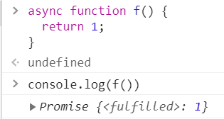
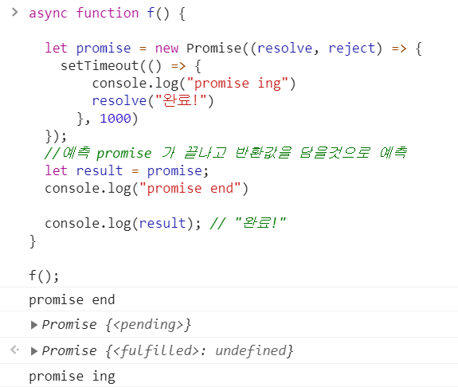
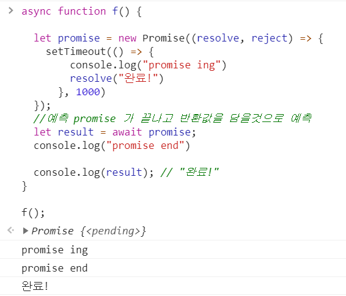

# [JS] ES6 async/await 

## 1.개요
<b style="color:tomato">async function</b> 은 <b style="color:tomato">ECMAScript2017</b>에 표준으로 정의된 스펙입니다. <br> 
internet Explorer 외의 거의 모든 브라우저에서 동작되고 있으니 배울 가치는 충분합니다. 

<b style="color:tomato">async/await</b> 는 왜 사용하는 것일까요 ?

이 문법을 사용하면 프라미스를 좀 더 편하게 사용할 수 있습니다. <b style="color:tomato">async/await</b>는 놀라울 정도로 이해하기 쉽고, 사용법도 어렵지 않습니다.

즉 <b style="color:tomato">async/await</b> 는 promise를 다루기 쉽게 사용하기 위해서 고안된 문법이라고 생각하시면 되겠습니다. 

이 포스팅을 읽기전에 Promise에 대해서 먼저 학습하시길 권합니다.<br>

Link : [Promise 학습하기](https://manbalboy.github.io/blog/javascript/2021-04-30-javascript-promise/)

## 2.문법
async 함수의 문법을 살펴보겠습니다. 

### 2-1.async 키워드
async 키워드부터 알아봅시다. async는 function 앞에 위치합니다.

```js
async function f() {
  return 1;
}
```

위의 코드를 실행해 보면 어떤 결과가 나올까요?



결과값이 <b style="color:tomato">Promise {\<fulfilled\> : 1} </b> 로 출력 되는 것을 볼 수 있습니다. 

이로써 async 함수를 붙이면 그 결과값은 Promise 형태로 반환된다는 async 함수의 특징하나를 배우신 겁니다. 

```js
async function f() {
  return 1;
}

async function f2() {
  return Promise.resolve(1);
}
```

f() 와 f2() 의 결과가 동일하다는 이야기 입니다.

정리하자면 <b style="color:tomato">async 키워드는 함수내부의 결과값을 Promise로 감싸서 반환</b>한다는 겁니다.

여기서 async 의 기능이 끝일까요? 아닙니다 async 내부의 await를 만나야 진정한 기능들이 발휘가 됩니다. 


### 2-1.await 키워드
await 키워드는 async 함수 내부에서만 사용할 수 있는 키워드 입니다. <br>
그럼 await 를 왜 사용하는 것일까요? 그 답은 함수 내의 비동기 처리를 순차적으로 동기적으로 처리해야할 때 매우 유용합니다. 

아래의 코드를 살펴보겠습니다. 

```js
async function f() {

  let promise = new Promise((resolve, reject) => {
    setTimeout(() => {
        console.log("promise ing")
        resolve("완료!")
      }, 1000)
  });
  //예측 promise 가 끝나고 반환값을 담을것으로 예측
  let result = promise; 
  console.log("promise end")

  console.log(result); // "완료!"
}

f();
```
위의 함수 실행시 저희가 원하고 예측한 콘솔 log 의 값의 순서는 다음과 같습니다. 

1. promise ing
2. promise end
3. "완료!"

과연 결과도 똑같을 까요?



위와 같이 end -> 결과값 -> ing 가 출력된 것을 볼 수 있습니다.<br>
이를 올바르게 출력하기위해서는 then 구문에 로직을 밀어 넣어야 할 것입니다. 

하지만 코드를 그대로 유지한채 await구문을 넣으면 그순간 Promise가 fullfilled 될때까지 다음 코드를 실행하지 않고 기다릴 수 있는 상태로 만들 수 있습니다. 

```js 
async function f() {

  let promise = new Promise((resolve, reject) => {
    setTimeout(() => {
        console.log("promise ing")
        resolve("완료!")
      }, 1000)
  });
  //예측 promise 가 끝나고 반환값을 담을것으로 예측
  let result = await promise;  // await 구문 추가
  console.log("promise end")

  console.log(result); // "완료!"
}

f();
```
위의 코드에서 <b style="color:tomato">let result = await promise;</b> await 구문을 추가하였을 뿐인데 실행결과는 다음과 같이 실행되었습니다. 



await 는 바꿔말하면 프로미스가 처리 될 때가지 함수 실행을 기다리게 만들고 then구문을 사용하지않고 바로 DATA를 얻을수 있습니다.

## 3. Error Handling
그렇다면 async await 의 Error 처리는 어떻게 할까요? <br>
바로 try..catch 문을 활용하여 error 처리를 합니다.

```js
async function f() {
  try {
    let response = await fetch('http://유효하지-않은-주소');
  } catch(err) {
    alert(err); // TypeError: failed to fetch
  }
}

f();
```
위의 코드와 같이 async await 는 try catch 문으로 error 처리를 해야 합니다. 

## 4.정리 
다시한번 위의 내용을 정리하면 다음과 같습니다. 

1. async 함수는 언제나 프로미스를 반환합니다. 
2. 함수안에서 await를 사용해서 비동기를 동기적으로 처리할 수 있다. 
3. 에러가 발생하면 throw error 를 호출한 것과 동일 하기 때문에 try..catch 문으로 에러를 처리한다. 
4. await 에러 미발생시 프라미스 객체의 result 값을 then 없이 반환
 
## 5.참고
- [ko.javascript.info](https://ko.javascript.info/async-await)
- [MDN](https://developer.mozilla.org/ko/docs/Web/JavaScript/Reference/Statements/async_function)
- [ECMA JS](https://262.ecma-international.org/6.0/ECMA-262.pdfn)
- [http://es6-features.org/](http://es6-features.org/#Constants)