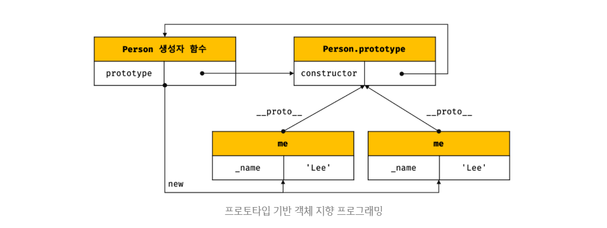

# [JS] ES6 Class

## 1.개요
자바스크립트는 <b style="color:tomato">프로토타입 기반</b> 객체지향 언어입니다.<br>
비록 다른 프로그램 언어들과의 차이점때문에 진정한 객체지향언어인가라는 논쟁이 있긴하지만, 자바스크립트는 강력한 객체지향 프로그래밍 능력을 지니고 있습니다.

프로토타입 기반 프로그래밍은 클래스가 필요없는 객체지향 프로그래밍 스타일로 프로토타입 체인과 클로저 등으로 객체 지향의 언어의 상송, 캡슐화(정보은닉) 등의 개념을 구현할 수 있습니다. 

## 2.기존 방식의 JS의 객체지향 프로그래밍
ES 5에서는 생성자 함수와 프로토타입, 클로저를 사용하여 객체 지향 프로그래밍을 구현하였습니다. 
```js
// ES5
var Person = (function () {
  // Constructor
  function Person(name) {
    this._name = name;
  }

  // public method
  Person.prototype.sayHi = function () {
    console.log('Hi! ' + this._name);
  };

  // return constructor
  return Person;
}());

var me = new Person('Lee');
me.sayHi(); // Hi! Lee.

console.log(me instanceof Person); // true
```

위 예제를 프로토타입 관점에서 표현해 보면 아래와 같습니다.



하지만 클래스 기반 언어에 익숙한 프로그래머들은 프로토타입 기반 프로그래밍 방식이 혼란스러울 수 있으며 자바스크립트를 어렵게 느끼게하는 하나의 장벽처럼 인식되었습니다.

ES6의 클래스는 기존 프로토타입 기반 객체지향 프로그래밍보다 클래스 기반 언어에 익숙한 프로그래머가 보다 빠르게 학습할 수 있는 단순명료한 새로운 문법을 제시하고 있으며.<br> 그렇다고 ES6의 클래스가 기존의 프로토타입 기반 객체지향 모델을 폐지하고 새로운 객체지향 모델을 제공하는 것은 아닙니다.<br> 
사실 클래스도 함수이며 기존 프로토타입 기반 패턴의 문법적 설탕(Syntactic sugar)이라고 볼 수 있다. 
다만, 클래스와 생성자 함수가 정확히 동일하게 동작하지는 않으며, 클래스가 보다 엄격하다고 볼 수 있습니다.


## 2.클래스 정의 (Class Definition)
ES6 클래스는 class 키워드를 사용하여 정의 합니다. 앞에서 살펴본 Person 생성자 함수를 클래스로 정의해 봅시다.

```js
//ES6
//클래스 선언문

class Person {
  //constructor 생성자
  constructor(name) {
    this._name = name;
  }

  sayHi() {
    console.log(`Hi! ${this._name}`);
  }
}


//인스턴스 생성
const me = new Person('Jung');
me.sayHi(); // Hi! Jung

console.log(me instanceof Person); //true
```

위와같이 class를 선언하고 사용 하시면 되겠습니다. 


하지만 Class를 선언 하고 사용할 때 주의점이 있습니다. Class는 선언 이전에  참조 할 수 없다는 것 입니다.

```js
//선언이전에 참조
console.log(Foo);
// ReferenceError: Cannot access 'Foo' before initialization

//참조이후에 선언
class Foo {}
```

또다른 주의점은 Class도 함수 표현식으로 정의할 수 있지만 클래스 이름에대한 식별자는 내부에서만 접근가능하게 바뀐다는 것입니다. 말이 어려워 혼란스러울 수 있습니다. 코드로 함께보시죠

```js
// 클래스명 MyClass는 함수 표현식과 동일하게 클래스 몸체 내부에서만 유효한 식별자이다.
const Foo = class MyClass {};

const foo = new Foo();
console.log(foo);  // MyClass {}

new MyClass(); // ReferenceError: MyClass is not defined
```

위의 코드에서 <br><b style="color:tomato">new MyClass(); // ReferenceError: MyClass is not defined</b><br>
부분에 주목해 보면 <b style="color:tomato">new Foo()</b> 는 접근이 되고 <b style="color:tomato">new MyClass()</b> 는 에러가 발생한다는 것을 주의해야할 필요가 있습니다.


## 3.인스턴스 생성
마치 생성자 함수와 같이 new 연산자와 함께 클래스 이름을 호출하면 클래스의 인스턴스가 생성됩니다.

```js
class Foo {}

const foo = new Foo();
```

여기까지 어렵지 않으시죠?

위 코드에서 <b style="color:tomato">new Foo()</b> 는 클래스의 이름이 아니라 생성자입니다. 

```js
// Foo는 사실 생성자 함수(constructor)이다.
console.log(Object.getPrototypeOf(foo).constructor === Foo); // true
```

당연한 이야기이겠지만 new 키워드를 사용하지 않고 constructor를 호출하면 타입에러가 발생합니다. 

```js
class Foo {}

const foo = Foo(); // TypeError: Class constructor Foo cannot be invoked without 'new'
```


## 4.constructor (생성자)
constructor는 인스턴스를 생성하고 클래스 필드를 초기화하기 위한 특수한 메소드 입니다.

> **클래스 필드(class field)**<br>
클래스 내부의 캡슐화된 변수를 말한다. 데이터 멤버 또는 멤버 변수라고도 부른다. 클래스 필드는 인스턴스의 프로퍼티 또는 정적 프로퍼티가 될 수 있다. 쉽게 말해, 자바스크립트의 생성자 함수에서 this에 추가한 프로퍼티를 클래스 기반 객체지향 언어에서는 클래스 필드라고 부른다.


```js
// 클래스 선언문
class Person {
  // constructor(생성자). 이름을 바꿀 수 없다.
  constructor(name) {
    // this는 클래스가 생성할 인스턴스를 가리킨다.
    // _name은 클래스 필드이다.
    this._name = name;
  }
}

// 인스턴스 생성
const me = new Person('Lee');
console.log(me); // Person {_name: "Lee"}
```
<b style="color:tomato">constructor</b>는 클래스 내에 한 개만 존재할 수 있으며 만약 클래스가 2개 이상의 <b style="color:tomato">constructor</b>를 포함하면 문법 에러(SyntaxError)가 발생합니다. 인스턴스를 생성할 때 <b style="color:tomato">new</b> 연산자와 함께 호출한 것이 바로 <b style="color:tomato">constructor</b>이며 <b style="color:tomato">constructor</b>의 파라미터에 전달한 값은 클래스 필드에 할당합니다.


## 5.클래스 필드
클래스 몸체(class body)에는 메소드만 선언할 수 있습니다. 클래스 바디에 클래스 필드(멤버 변수)를 선언하면 문법 에러(SyntaxError)가 발생 합니다.

```js
class Foo {
  name = ''; // SyntaxError

  constructor() {}
}
```

그렇기 때문에 클래스 필드의 선언과 초기화는 반드시 constructor 내부에서 실시 합니다.

```js
class Foo {
  constructor(name = '') {
    this.name = name; // 클래스 필드의 선언과 초기화
  }
}

const foo = new Foo('Lee');
console.log(foo); // Foo { name: 'Lee' }
```


## 6.getter
getter는 클래스 필드에 접근할 때마다 클래스 필드의 값을 조작하는 행위가 필요할 때 사용합니다. getter는 메소드 이름 앞에 get 키워드를 사용해 정의하며, 이때 메소드 이름은 클래스 필드 이름처럼 사용됩니다.<br>
다시 말해 getter는 호출하는 것이 아니라 프로퍼티처럼 참조하는 형식으로 사용하며 참조 시에 메소드가 호출됩니다. getter는 이름 그대로 무언가를 취득할 때 사용하므로 반드시 무언가를 반환해야 하며 사용 방법은 아래 코드와 같습니다.

```js
class Foo {
  constructor(arr = []) {
    this._arr = arr;
  }

  // getter: get 키워드 뒤에 오는 메소드 이름 firstElem은 클래스 필드 이름처럼 사용된다.
  get firstElem() {
    // getter는 반드시 무언가를 반환해야 한다.
    return this._arr.length ? this._arr[0] : null;
  }
}

const foo = new Foo([1, 2]);
// 필드 firstElem에 접근하면 getter가 호출된다.
console.log(foo.firstElem); // 1
```


## 7.setter
setter는 클래스 필드에 값을 할당할 때마다 클래스 필드의 값을 조작하는 행위가 필요할 때 사용합니다. setter는 메소드 이름 앞에 set 키워드를 사용해 정의하며, 이때 메소드 이름은 클래스 필드 이름처럼 사용됩니다.<br> 
다시 말해 setter는 호출하는 것이 아니라 프로퍼티처럼 값을 할당하는 형식으로 사용하며 할당 시에 메소드가 호출되며 사용 방법은 아래 코드를 살펴 봅니다.
```js
class Foo {
  constructor(arr = []) {
    this._arr = arr;
  }

  // getter: get 키워드 뒤에 오는 메소드 이름 firstElem은 클래스 필드 이름처럼 사용된다.
  get firstElem() {
    // getter는 반드시 무언가를 반환하여야 한다.
    return this._arr.length ? this._arr[0] : null;
  }

  // setter: set 키워드 뒤에 오는 메소드 이름 firstElem은 클래스 필드 이름처럼 사용된다.
  set firstElem(elem) {
    // ...this._arr은 this._arr를 개별 요소로 분리한다
    this._arr = [elem, ...this._arr];
  }
}

const foo = new Foo([1, 2]);

// 클래스 필드 lastElem에 값을 할당하면 setter가 호출된다.
foo.firstElem = 100;

console.log(foo.firstElem); // 100
```

## 8.static 메소드 (정적 메소드)
클래스의 정적(static) 메소드를 정의할 때 static 키워드를 사용한다. 정적 메소드는 클래스의 인스턴스가 아닌 클래스 이름으로 호출한다. 따라서 클래스의 인스턴스를 생성하지 않아도 호출할 수 있다.
```js
class Foo {
  constructor(prop) {
    this.prop = prop;
  }

  static staticMethod() {
    /*
    정적 메소드는 this를 사용할 수 없다.
    정적 메소드 내부에서 this는 클래스의 인스턴스가 아닌 클래스 자신을 가리킨다.
    */
    return 'staticMethod';
  }

  prototypeMethod() {
    return this.prop;
  }
}

// 정적 메소드는 클래스 이름으로 호출한다.
console.log(Foo.staticMethod());

const foo = new Foo(123);
// 정적 메소드는 인스턴스로 호출할 수 없다.
console.log(foo.staticMethod()); // Uncaught TypeError: foo.staticMethod is not a function
```


## 9.클래스 상속
클래스 상속(Class Inheritance)은 코드 재사용 관점에서 매우 유용합니다. <br>
새롭게 정의할 클래스가 기존에 있는 클래스와 매우 유사하다면, 상속을 통해 그대로 사용하되 다른 점만 구현하면 됩니다. 코드 재사용은 개발 비용을 현저히 줄일 수 있는 잠재력이 있으므로 매우 중요합니다.

extends 키워드는 부모 클래스(base class)를 상속받는 자식 클래스(sub class)를 정의할 때 사용한다. 부모 클래스 Circle을 상속받는 자식 클래스 Cylinder를 정의해 보자.

```js
// 부모 클래스
class Circle {
  constructor(radius) {
    this.radius = radius; // 반지름
  }

  // 원의 지름
  getDiameter() {
    return 2 * this.radius;
  }

  // 원의 둘레
  getPerimeter() {
    return 2 * Math.PI * this.radius;
  }

  // 원의 넓이
  getArea() {
    return Math.PI * Math.pow(this.radius, 2);
  }
}

// 자식 클래스
class Cylinder extends Circle {
  constructor(radius, height) {
    super(radius);
    this.height = height;
  }

  // 원통의 넓이: 부모 클래스의 getArea 메소드를 오버라이딩하였다.
  getArea() {
    // (원통의 높이 * 원의 둘레) + (2 * 원의 넓이)
    return (this.height * super.getPerimeter()) + (2 * super.getArea());
  }

  // 원통의 부피
  getVolume() {
    return super.getArea() * this.height;
  }
}

// 반지름이 2, 높이가 10인 원통
const cylinder = new Cylinder(2, 10);

// 원의 지름
console.log(cylinder.getDiameter());  // 4
// 원의 둘레
console.log(cylinder.getPerimeter()); // 12.566370614359172
// 원통의 넓이
console.log(cylinder.getArea());      // 150.79644737231007
// 원통의 부피
console.log(cylinder.getVolume());    // 125.66370614359172

// cylinder는 Cylinder 클래스의 인스턴스이다.
console.log(cylinder instanceof Cylinder); // true
// cylinder는 Circle 클래스의 인스턴스이다.
console.log(cylinder instanceof Circle);   // true
```

이로써 상속 까지 모두 살펴 보았습니다. 

## 10. 정리
ES6 class 문법을 객체지향 프로그래밍을 더욱 쉽고 간편하게 해주는 문법으로 javascript가 다른 문법의 장점들을 수용할 것이라는 것을 보여주는 단적인 예 입니다. 현재 Private Property 과 같이 다른 문법에서도 사용되는 부분들이 스펙검토중에 있기때문에 앞으로 사용될 여지가 있다고 본다.

## 11.참고
- [ECMA JS](https://262.ecma-international.org/6.0/ECMA-262.pdfn)
- [http://es6-features.org/](http://es6-features.org/#Constants)
- [https://poiemaweb.com/es6-class](https://poiemaweb.com/es6-class)