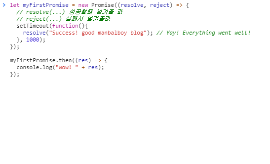

# [JS] ES6 Promise

## 1.개요
Promise 객체는 비동기 작업이 맞이할 미래의 완료 또는 실패와 그 결과값을 나타내는 객체입니다. 

### 1-1.탄생 배경
JavaScript의 세계에서는 거의 대부분의 작업들이 비동기로 이루어 집니다. 어떤 작업을 요청하면서 콜백 함수를 등록하면, 작업이 수행되고 나서 결과를 나중에 콜백 함수를 통해 알려주는 식으로 코드가 동작되는게 대부분이죠. 

실제 비동기 작업이 아니더라도 JavaScript의 세계에서는 결과를 콜백으로 알려주는 패턴이 매우 흔하게 사용되고 있습니다. 

초기의 JavaScript의 경우 버튼이 눌렸을 때(이벤트 발생) 특정 작업을 수행(콜백 함수 호출)하는 정도의 수준이었기 때문에 복잡도가 높지 않았지만 최근에는 프론트엔드의 규모가 상당히 커져서 JavaScript로 작성하는 코드를 단순하게 바라볼 수준은 넘어선지 오래입니다. 

코드의 복잡도가 높아지는 상황에서 특히 어려워지는 케이스는 콜백이 중첩되는 경우이며. 하나의 작업을 콜백으로 결과를 받은 뒤 순차적으로 다음 작업을 진행하고자 할 때 이러한 콜백 중첩, 이른바 콜백 지옥을 만나게 되는 결과를 쉽게 경헙해 볼 수 있습니다. 

<strong style="color:tomato">콜백 지옥(callback hell)은</strong> 개발자들 사이에서 풀어야할 숙제 였으며 이러한 것들을 해결하기 위해 많은 패턴이 고안되었고 발전해서 ES6에서 Promise 객체가 탄생되었습니다.  


```js
// callback hell
callBack(1, function() {
  callBack(2, function () {
    callBack(3, function () {
      callBack(4, function () {
         console.log("여기가 완료인가??")
      });
    });
  });
});
```

Promise 는 ECMA Script 6 에 정식 스펙이며 Node.js 에서도 이를 지원하고 있는 정식적으로 사용할수 있는 스펙이며 요즘 라이브러리들은 비동기 처리를 Promise 를 통해 하므로 필수적인 기술 요소로 자리 잡고 있습니다. 

## 2. Promise 들여다보기
Promise는 크게 3가지 상태로 나뉘어져 있습니다. 
- 대기(pending) : 이행하거나 거부되지 않은 초기 상태.
- 이행(fulfilled) : 연산이 성공적으로 완료.
- 거부(rejected) : 연산이 실패함.

대기 중인 프로미스는 값과 함께 이행될수도 , 어떠한 이유로 거부될 수 있습니다. 
이행이나 거부상태의 프로미스는 반환값이 프로미스이므로 체이닝이 가능합니다. 


 <sub>출처 : MDN</sub>


이론은 여기까지 하고 코드로 알아볼까요??

먼저 Promise 를 선언하고 사용하는 것은 어떻게 할까요 

```js
let promise = new Promise((resolve, reject) => {
  //처리 로직
  if(isErr) {
    resolve("성공시 표현될 DATA") ;
  } else {
    reject("실패시 표현될 DATA");
  }
});


promise.then(res => {
  // 성공시 일어나야할 로직
}).catch(err => {
  // 실패시 일어나야할 로직
});
```

어떠신가요 코드를 봤을 때 감이 오시나요 ?? new Promise 는 알겠는데 resolve, reject는 뭐지 then ?? catch는 뭐지 ?? 이해가 잘 안되도 상관 없습니다. 처음 접하신 분들은 이해하기 조금 난해할 수 있습니다. 

천천히 하나 하나 살펴보겠습니다. 먼저 Promise 는 new Promise를 통해 생성되는것 까지는 이해 하셨으리라 생각하고 진행하겠습니다. 

쉽게 생각해서 Promise는 객체가 생성될때 인자로 함수를 받는데 (콜백함수라고 생각하면 쉬울것 같습니다.) 그 함수에 두개의 함수를 또 인자로 받습니다 
성공값을 담아주는 resolve와 실패값을 reject 입니다. 

처리로직 주석부분에서 콜백이 일어나기전 비동기 처리 로직을 코딩한후, 
실제 사용(기존 코드로 비유하자면 ajax 콜백)은 성공시 then 실패시 catch 부분에서 실행됩니다.  

비동기 로직 setTimeout 을 이용한 코드로 다시한번 살펴 볼까요? 

```js
let myFirstPromise = new Promise((resolve, reject) => {
  // resolve(...) 성공할때 넘겨줄 값 
  // reject(...) 실패시 넘겨줄값
  setTimeout(function(){
    resolve("Success! good manbalboy blog"); 
  }, 1000);
});

myFirstPromise.then((res) => {
  console.log("wow! " + res);
});
```

위의 코드를 실행하면 1초되에 console.log 가 찍히는 것을 볼 수 있습니다. 



이제 조금 감을 익히셨나요?

이해하기 어렵더라도 자주 사용해보고 감을 익혀보시길 바랍니다. 

## 3. Promise의 속성과 매서드
### 3-1. 속성
프로미스의 속성은 어려울 것이 없다. 
- Promise.length : 항상 언제나 값이 1인 길이 속성
- Promise.prototype : Promise 생성자의 프로토타입을 나타냅니다. 

### 3-2. 매서드
- Promise.all(iterable) : iterable 내의 모든 프로미스가 이행한 뒤 이행 어떤 프로미스가 거부하면 즉시 거부하는 프로미스를 반환합니다.

- Promise.race(iterable) : iterable 내의 어떤 프로미스가 이행하거나 거부하는 즉시 스스로 이행하거나 거부하는 프로미스를 반환합니다. 이행 값이나 거부 이유는 원 프로미스의 값이나 이유를 그대로 사용합니다.

- Promise.reject() :주어진 이유로 거부하는 Promise 객체를 반환합니다.

- Promise.resolve() :주어진 값으로 이행하는 Promise 객체를 반환합니다. 값이 then 가능한 (즉, then 메서드가 있는) 경우, 반환된 프로미스는 then 메서드를 따라가고 마지막 상태를 취합니다. 그렇지 않은 경우 반환된 프로미스는 주어진 값으로 이행합니다. 어떤 값이 프로미스인지 아닌지 알 수 없는 경우, Promise.resolve(value) 후 반환값을 프로미스로 처리할 수 있습니다 

