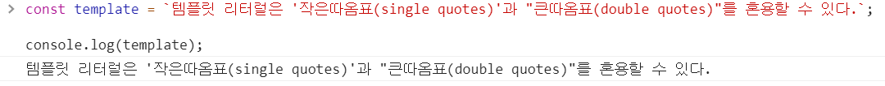
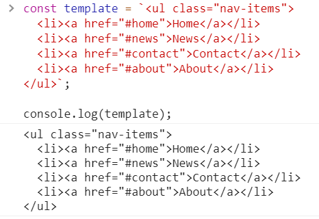
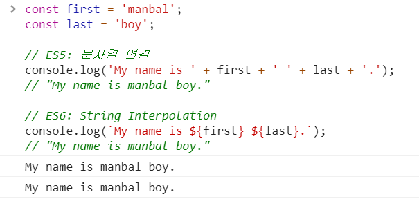
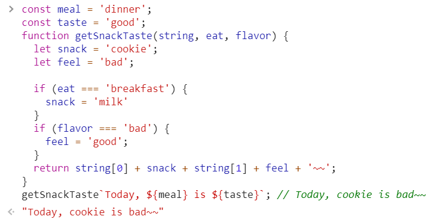

# [JS] Template literals (템플릿 문자열)

## 1.개요
템플릿 리터럴은 내장된 표현식을 허용하는 문자열 리터럴입니다. 여러 줄로 이뤄진 문자열과 문자 보간기능을 사용할 수 있습니다. 이전 버전의 ES2015사양 명세에서는 "template strings" (템플릿 문자열) 라고 불려 왔습니다.

## 2.Syntax 
문법은 백틱 ` 을 이용한 스트링이라고 생각 하시면 됩니다. 다음 코드를 살펴볼까요? 

```js
`string text`

`string text line 1
 string text line 2`

`string text ${expression} string text`

tag `string text ${expression} string text`
```

위의 \` 는 홑따옴표가 절대 아닙니다. 키보드 기준 1 옆에있는 문자 \` <strong style="color:tomato">백틱(backtick)</strong> 입니다. 


위의 코드를 하나하나 다시 예제를 들어가며 살펴 볼까요? 

### 2-1 리터럴의 따옴표와 큰따옴표처리
```js
const template = `템플릿 리터럴은 '작은따옴표(single quotes)'과 "큰따옴표(double quotes)"를 혼용할 수 있다.`;

console.log(template);
```
위의 코드는 다음과 같이 실행됩니다. 



저는 정말 획기적이라고 생각 했는데 여러분은 어떠신가요? 만약 ES6 에서 템플릿 리터럴 문법이 나오지 않았으면 위의 코드는 다음과 같이 작성해야 했습니다. 

```js
const template = "템플릿 리터럴은" +"'작은따옴표(single quotes)'과 "+ "\"큰따옴표(double quotes)\"를 혼용할 수 있다.";

console.log(template);
```
정말  문자열 지옥입니다. 위와같은 방식은 오류를 찾기 힘들며 오타 발생확률이 높아지는 코드입니다. 

### 2-2 리터럴의 줄바꿈처리
리터럴은 줄바꿈이 허용된다는 장점도 가지고 있습니다. 다음 코드를 보시죠 

```js
const template = `<ul class="nav-items">
  <li><a href="#home">Home</a></li>
  <li><a href="#news">News</a></li>
  <li><a href="#contact">Contact</a></li>
  <li><a href="#about">About</a></li>
</ul>`;

console.log(template);
```
위의 코드를 실행하면 아래의 코드와 같은 형태로 여러줄 이 출력됩니다. 




### 2-3 리터럴의 스트링 인터폴레이션(String Interpolation)
스트링 인터폴레이션 이란 무엇일까요 문자열 보간 이라고 해석되는 이 기능은 문자열 복합 서식 지정 이라는 뜻을 지니고 있습니다. 뜻은 어렵지만 그냥 쉽게 문자열에서 사용되는 수식이라고 이해하시면 되겠습니다. 

역시 개발자는 글보단 코드죠 코드로 이해해 봅시다. 

```js
const first = 'manbal';
const last = 'boy';

// ES5: 문자열 연결
console.log('My name is ' + first + ' ' + last + '.');
// "My name is manbal boy."

// ES6: String Interpolation
console.log(`My name is ${first} ${last}.`);
// "My name is manbal boy."
```

위의 코드를 입력하면 다음과 같이 결과가 나옵니다. 




어떠한가요 ES5 문자열보다 ES6문법이 더 간결한거 같습니다. 

### 2-4 Tagged Template Literals 
Tagged Template Literals은 사실 아직 활용법들이 널리 알려지지는 않았습니다. react 개발자분들께서는 styled-component라는 라이브러리를  사용해보셨어야 이 문법을 접해보셨을 꺼라 생각됩니다.


```js
// styled-components
const Title = styled.h1`
 font-size: 1.5em;
 text-align: center;
 color: palevioletred;
`;
```

많이 당황스럽죠 이 코드는 도대체 뭐야 이러신 분들도 있으실 겁니다. 

하지만 찬참히 이해해 보도록 노력해봅시다. 이 agged Template Literals는 Template Literals를 이용하여 함수의 인자를 파싱하여 넘겨주는 것입니다. 아래의 코드를 console.log로 찍어보면 어떻게 나올까요?

```js
const meal = 'dinner';
const taste = 'good';
function getSnackTaste(string, eat, flavor) {
  let snack = 'cookie';
  let feel = 'bad';
  
  if (eat === 'breakfast') {
    snack = 'milk'
  }
  if (flavor === 'bad') {
    feel = 'good';
  }
  return string[0] + snack + string[1] + feel + '~~';
}
getSnackTaste`Today, ${meal} is ${taste}`; // Today, cookie is bad~~
```

위의 결과는 다음과 같습니다. 



정말인지 소스를 보니 더 멘붕에빠지신다고요? 찬찬히 파라미터들을 console.log로 출력해봅시다.

```js
["Today, ", " is ", ""] "dinner" "good"
```

결과는 다음과 같습니다. 
왜이러한 결과가 나왔을 까요? 문자열 보간을 뺀나머지 문자열들을 배열화해 첫번째 인자에 대입되었고 문자열 보간법에 의해서 하나씩 파라미터에 할당된 것을 보실 수 있습니다. 

이러한 성질을 이용해서 어떠한 이점을 챙기고 있는지는 필자는 아직 찾지 못하였습니다. 획기적인 코드 활용방안을 알고 계신분은 공유 부탁드리겠습니다. 

## 정리
ES6 템플릿 리터럴은 정말 문자열에 일대 혁명을 불어일으킨 장본인이라고 할 수 있으면 더깔끔한 코드를 위해 적극적으로 사용하라고 권장드리고 싶다.