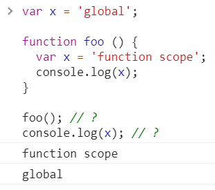
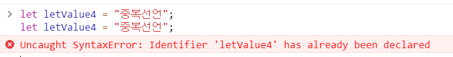
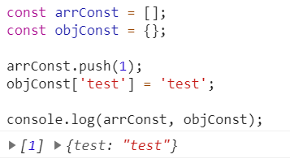

# [JS] JS의 변수의 종류와 사용방법 (let, const, let)

## 1.개요
javascript 의 변수 keyword 는 총 3가지 입니다. 
- var (ES5)
- const (ES6)
- let (ES6)

그렇다면 어떠한 것들로 변수를 선언하여 사용해야할까요? 어떠한 상황에서 저 3가지 변수 keyword를 사용해 변수를 선언해야하는지 어떠한 특성을 가지고 있는지 알아보는 것이 이번 포스팅의 목표 입니다. 

## 2.각각의 변수의 특징

### 2-1 scope
각각의 변수의 특징에대해서 알아보기 이전에
scope 에 대해서 간단하게 알아보고 넘어가겠습니다. scope란 유효범위를 뜻합니다. 변수가 읽히는 범위라고 생각 하시면 됩니다. 그럼 다음 코드의 실행 결과를 예측해 보세요 

~~~js 
// file : "var scope 에 대한 이해"
  var x = 'global';

  function foo () {
    var x = 'function scope';
    console.log(x);
  }

  foo(); // ?
  console.log(x); // ?
~~~

foo() 와 x 의 값은 무엇일까요 ? 답은 아래의 사진과 같은 결과가 나옵니다. 




이 결과로 봤을때 같은 이름 x 라고 선언을 하였어도 다른 값이 표현되는 것을 알 수 있습니다. 어떠한 규칙을가지고 JS 는 변수를 어떻게 다른값이 나오도록 하였을 까요? 이러한 규칙이 바로 변수의 스코프 입니다. 

다시 정리하자면 <strong style="color:tomato">스코프는 참조 대상 식별자(identifier, 변수, 함수의 이름과 같이 어떤 대상을 다른 대상과 구분하여 식별할 수 있는 유일한 이름)를 찾아내기 위한 규칙 입니다. </strong> 이해가 조금 되셨나요? 

변수 식별에 가장 중요한 부분중 한 부분이 바로 scope 이기때문에 한발자국 더 나아가 scope의 구분에 대해서도 알아보겠습니다. 

### 2-2 scope 종류
scope의 종류는 전역스코프와 지역스코프가 있습니다. 

 - 전역 스코프 (Global scope) 
   
   코드 어디에서든지 참조할 수 있다.
 
 - 지역 스코프 (Local scope or Function-level scope)
  
    함수 코드 블록이 만든 스코프로 함수 자신과 하위 함수에서만 참조할 수 있다.

많이 들어보신 용어들 이기 때문에 익숙 하실 것이라 믿겠습니다. 
여기서 코드 블록이란  { ... } 이러한 형태 즉 중괄호를 말하며 ES5 변수는 함수레벨 스코프 였습니다. 하지만 ES6부터 블록단위의 스코프를 가지게 할 수있는 변수가 생겨났으므로 용어적 분리가 필요합니다. 

```js
function (){
  //함수 레벨 블록 스코프
} 

{
  //블록스코프
}

if(true) {
  //블록스코프
}

for (var a = 0; a < 5; a++) {
  //블록 스코프
}
```
위의 코드를 봤을때 무엇이 함수레벨블록 스코프이고 블록스코프인지 차이점을 인지해야합니다. 


### 2-3 var
var 는 전통적인 JS 의 변수 선언 키워드입니다. variable 의 약자이기도한 var는 다음과 같이 사용할 수 있습니다. 

```js
// var [변수이름] = [값];

var test = 'manbalboy';
var test1, test2;

console.log(test, test1, test2);
// manbalboy , undefined , undefined
```

정말 쉽죠? 그리고 var는 <strong style="color:tomato">무한 반복해서 선언 할 수 있습니다.</strong> 이 말이 무엇이냐하면 var는 계속해서 똑같은 변수 이름으로 계속 선언 할 수 있다는 것 입니다. 

```js
  var test = "manbalboy" ;
  var test = "sunjoong91" ;
  
  console.log(test);
  // sunjoong91
```

그리고 var 의 특징은 <strong style="color:tomato">'function scope'</strong> 라는 것입니다. 

이것은 코드로 이해하는 것이 빠릅니다. 

```js
var a = 10;
for (var a = 0; a < 5; a++) {
    console.log(a); // 0 1 2 3 4 5
}
console.log(a); // ?


var ab = 100;
function print() {
    var ab = 10;
    console.log(ab);
}
print(); // ?
```

위의 간단한 예제는 a의 유효범위 예측과 ab의 유효범위 예측을 위한 예제 코드 입니다. 과연 ? 의 결과값은 무엇일까요 .

```js
console.log(a); //6 

print() //10
```

결과는 위와 같습니다. 

var를 정리를 하자면 var는 함수안의 블록에서만 지역변수로 작동을하고 다른 블록에서는 전역으로 작동을 하는것을 알수 있습니다. 


### 2-4 let 
let 은 es6에 발표된 새로운 변수 선언 키워드입니다. 선언방식은 var와 다르지 않습니다. 

```js
//let [변수이름] = [값];
let letValue = "manbalboy";
let letValue2, letValue3;

```

별로 차이가 없는것 같은데 왜 let 변수가 생겨 났을까요? 
var 와 let 의 큰차이점은 2가지로 요약 할 수 있습니다.

- 같은 스코프내의 중복 선언이 불가능
- block 스코프

이것이 무슨 내용일까요? 코드로 살펴볼까요? 


```js 
let letValue4 = "중복선언";
let letValue4 = "중복선언";

//Uncaught SyntaxError: Identifier 'letValue4' has already been declared
```

위의 코드를 실행하면 


이러한 결과가 나옵니다. 이렇게 let은 같은 scope내의 중복 선언이 불가합니다. 

어떠한 이점이 있을까요? 의도하지 않은 변수 선언을 미리 방지 할 수 있는 측면이 있습니다.

다른 차이점도 살펴 볼까요? 

```js
let a = 10;
for (let a = 0; a < 5; a++) {
    console.log(a); // 0 1 2 3 4 5
}
console.log(a); // ?
```

위의 코드의 결과는 무엇일까요 var의 예제에서 키워드만 let으로 바꾼 예제 입니다. 정답은 바로 10 입니다. 

```js
console.log(a); // 10
```

이렇게 let 은 for문 블럭에서도 스코프를 유지하는것을 볼수 있습니다. 

### 2-5 const
마지막으로 const를 살펴볼까요? 
const는 let과 기능적으로는 다 똑같습니다 block scope 이며 반복정의가 되지 않습니다. 그러면 let과 다른점은 무엇일까요? 

바로 const는 값을 재할당 할 수 없습니다. 

```js
const constValue = "manbalboy";
constValue = "재할당";
//VM2095:2 Uncaught TypeError: Assignment to constant variable.
```

 <strong style="color:tomato"> TypeError: Assignment to constant variable. </strong> 가 발생 하는 것을 볼 수 있습니다. 

 하지만 예외 사항이있습니다. Object , Array 와 같은 객체들을 다루면 값을 추가할 수 있습니다. 

 ```js
const arrConst = [];
const objConst = {};

arrConst.push(1);
objConst['test'] = 'test';

console.log(arrConst, objConst);
 ```

위의 결과를 실행하면



이러한 결과가 나옵니다.

이렇게 const 를 이용해 변수를 선언해서 오브젝트를 다루는 방법은 많이 사용되니 꼭 이해하셨으면 좋겠습니다. 

## 3.정리
요번 포스팅에서는 js의 변수 키워드의 종류와 각각의 특징에 대해서 알아봤습니다. 중요한점은 스코프에 대한 이해가 가장 중요한 것 같습니다. 

또한 앞으로의 변수 선언방식을 어떻게 할 것인지 고민하시고 계시다면 기본은 const 로 선언한후 원시값을 변경할 변수면 let 로 바꾸는 것을 추천드리며 var는 되도록 사용하지 않는 방향으로 코딩을 하시면 되겠습니다. 