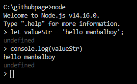

# [NODE] REPL 사용하기


## 1.REPL 이란?

> REPL(read-eval-print loop) 또는 인터랙티브 톱레벨(interactive toplevel), 랭기지 셸(language shell)은 단일 사용자의 입력(예: 단일 식)을 취하고 이를 평가(실행)하고 결과를 사용자에게 반환시키는 단순한 상호작용 컴퓨터 프로그래밍 환경이다. REPL 환경으로 작성된 프로그램은 구간마다 실행된다. 이 용어는 보통 클래식 리스프 머신 상호작용 환경과 유사한 프로그래밍 인터페이스를 의미하기도 한다. 일반적인 예로는 프로그래밍 언어를 위한 명령 줄 셸 및 유사 환경을 들 수 있으며 기법은 스크립트 언어의 특징과 매우 닮아있다.


위의 내용은 위키백과에서 발췌한 내용이다. 위의 내용은 너무 어렵게 설명이 되어 있는것 같다. 간단히 말해서 콘솔 환경에서 node를 이용해서 javascript 를 실행시킬수 있는 상태로 만드는것을 REPL 이라고 생각하면된다. 
사용법은 다음과 같다 

```bash
# file:'node repl'
$ node

> let valueStr = 'hello manbalboy'
```

위의 코드와 같이 node 라고 커멘드 명령어를 치면 
커서가 > 형태로 바뀌면 그때부터 js 코드를 입력하면 해석이 가능해진다. 



## 2. 정리
REPL(read-eval-print loop)의 약어를 알아보고 실행해 보았아 무척이나 쉽고 간단하니 간편하게 테스트할때 유용하게 repl 을 사용하자 .. ~~사실 별로 안씀~~