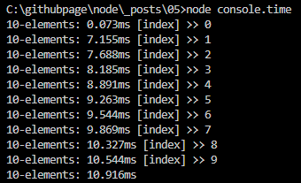

# [NODE] NODE.js의 console

## 1.개요
브라우저 에서의 <b style="color:tomato">console</b> 객체와 거의 유사합니다. 그렇기에 이해하기도 쉽고 직관적이게 와닿는 기능입니다. 

<b style="color:tomato">Node.js</b> 에서의 <b style="color:tomato">console</b>은 <b style="color:tomato">window</b> 객체 대신 <b style="color:tomato">global</b> 객체 안에 들어 있습니다.

console 객체는 주로 디버깅용도 안내문구등을 표현하기 위해 사용됩니다.

## 2.메서드 종류
console 객체는 여러가지 메서드 들이 있어 많은 기능들을 표현할 수 있습니다.

목차는 다음과 같습니다. 

- console.assert(value\[, ...message\])
- console.clear\(\)
- console.count(\[label\])
- console.countReset(\[label\])
- console.debug(data[, ...args])
- console.dir(obj[, options])
- console.dirxml(...data)
- console.error(\[data\][, ...args])
- console.group(\[...label\])
- console.groupCollapsed()
- console.groupEnd\(\)
- console.info\(\[data\]\[, ...args\])
- console.log(\[data\]\[, ...args\])
- console.table(tabularData[, properties])
- console.time([label])
- console.timeEnd([label])
- console.timeLog([label][, ...data])
- console.trace([message][, ...args])
- console.warn([data][, ...args])
- console.profile([label])
- console.profileEnd([label])
- console.timeStamp([label])

이렇게 여러가지 매소드들이 있기 때문에 적절한 상황에서 올바른 사용법으로 사용하시면 원하는 DATA의 값이나 문구들을 console 창에 나타낼 수 있습니다.


## 3.대표적인 매서드 살펴보기

대표적인 console 사용법에대해서 몇가지 살펴보겠습니다.

### 3-1 console.log()
대표적인 console.log() 에 대해 살펴보겠습니다. 

> 평범한 로그를 콘솔에 표시 

```js
// file: "console.log.js"

const name = "manbalboy";
const obj = {
    name : "Hun",
    age : 33 
}
const job = "developer";

console.log(name, obj, job);
```

위의 코드를 node로 실행하면 다음과 같습니다. 


Chrome 개발자 도구에서 와의 차이점이 전혀 없습니다. 


### 3-2 console.error()
에러를 표시할 때 사용됩니다.

```js
// file: "console.error.js"

const name = "manbalboy";
const obj = {
    name : "Hun",
    age : 33 
}
const job = "developer";

console.error(name, obj, job);
```

### 3-3 console.dir()
주로 복잡한 객체를 console 에 표현 할때 사용됩니다. 첫번째 인수에 출력할 변수로 인자로 넣고 두번째 인수로 옵션을 넣어 사용합니다.

```js
// file: "console.dir.js"

const dirObj = {
    depth1: {
        depth2: {
            depth3: {
                key: "depth3 key",
                array : [1,2,3,4,5]
            },
            key: "depth2 key"
        },
        key: "depth1 key"
    },
    key: "root key"
}
console.log("=====옵션 colors true =====");
console.dir(dirObj, {colors : true});
console.log("=====옵션 colors false =====");
console.dir(dirObj, {colors : false});
console.log("=====옵션 depth 3 =====");
console.dir(dirObj, {depth : 3});
```
위의 코드를 실행하면 다음과 같은 결과가 표출 됩니다. 


옵션에는 colors 속성과 depth 속성 showHidden 속성이 있습니다. 

### 3-4 console.time()
사용법은 <b style="color:tomato">console.time('레이블')</b> 이와 같이 사용되며 <b style="color:tomato">console.timeEnd('레이블')</b> 과 대응되어 같은 레이블을 가진 <b style="color:tomato">time과 timeEnd사이의 시간을 측정</b>해 줍니다.  

시작과 끝지점 사이의 특정 시간을 찍고싶으면 timeLog 매서드를 사용하여 시간을 확인하면 됩니다.

```js
// file: "console.time.js" 

console.time('10-elements');
for (let i = 0; i < 10; i++) {
  console.timeLog('10-elements', `[index] >> ${i}`);
}
console.timeEnd('10-elements');

```



## 4.정리
이번에는 console 에 대해서 알아보았는데요 모든 내장 매서드에서 알아보진 않았지만 많이 사용하는 매서드위주로 몇가지 사용법을 알아 보았습니다. 

다루기 쉽고 이해하기 쉬운 객체이므로 궁금하신 매서드는 직접 코딩을 작성하셔서 적절한 곳에서 사용하는 것을 추천 드립니다. 

## 5.참고자료
[nodejs.org](https://nodejs.org/api/console.html)


