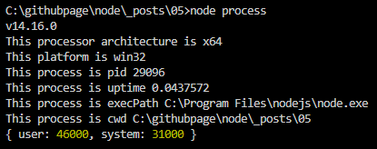

# [NODE] NODE.js의 process object

## 1.개요
NODE에서는 Node의 Process 상태를 제어하고 정보를 제공해주는 Process Objecet 를 제공합니다. <br>
이 Object는 require() 없이 사용 할 수 있는 전역 객체 입니다.

## 2.process의 속성
process의 속성은 여러가지가 있습니다. 여기에서는 몇 가지만 살펴보고 자세한 내용은 [노드공식홈페이지](https://nodejs.org/api/process.html) 에서 필요한 부분이 발생될 때 찾아서 활용 하였으면 합니다.

```js
// file: "process.js"

// 설치된 노드의 버전
console.log(process.version)

// 프로세서 아키텍쳐 정보
console.log(`This processor architecture is ${process.arch}`);

// 프로세서 운영체제 정보 : 반환값은 다음과 같습니다 'aix, darwin, freebsd, linux, openbsd, sunos, win32'
console.log(`This platform is ${process.platform}`);

// 현재 프로세스의 id
console.log(`This process is pid ${process.pid}`);

// 프로세스가 시작된 후 흐른 시간
console.log(`This process is uptime ${process.uptime()}`);

// node 설치경로
console.log(`This process is execPath ${process.execPath}`);

// 현재 node 가 실행되는 경로
console.log(`This process is cwd ${process.cwd()}`);

// 현재 cpu 사용량
console.log(process.cpuUsage());
```

위의 소스를 실행하면 다음과 같은 결과를 얻을 수 있습니다. 



 
더 많은 process의 활용법 이 많지만 그중 env,nextTick,exit 는 많이 사용하므로 챕터를 나누어 살펴 보겠습니다. 

## 3.process.env
```js 
console.log(process.env);
```
위의 코드를 node 로 실행하면 시스템의 환경변수를 불러오거나 저장할 수 있습니다. 환경변수에 담아서 사용하는 방법은 시스템별로 상의 하여 dotenv를 사용하여 env 를 이용합니다. 이는 추후에 다시 학습하겠습니다. 


## 4.process.nextTick()
이 함수는 이벤트루프가 다른 콜백함수 보다 먼저 우선으로 처리하도록 만드는 함수 입니다. 일종의 새치기를 해서라도 먼저 실행되라 라는 명령어 입니다. 

[이벤트루프](https://manbalboy.github.io/blog/javascript/2021-04-24-javascript01/)는 태스크 큐가 있는데 이는 일반 태스크큐와 마이크로 태스크 큐로 나누어지며 우선순위가 마이크로 태스크 큐가 먼저 실행되는 매커니즘으로 이루어 져 있습니다. 

마이크로 태스크 큐에 속하는 함수는 Promise, nextTick 등이 있습니다.

```js
// file: "next-tick.js"

setImmediate(() => {
    console.log('immediate');
});

process.nextTick(() =>{
    console.log('nextTick');
});

setTimeout(() => {
    console.log('timeout');
},0);

Promise.resolve().then(() =>{console.log('Promise')})
```

위의 코드를 실행하면 순서는 다음과 같습니다. 
- nextTick
- Promise
- timeout
- immediate

timeout 과 immediate 는 결과가 달라질 수 있습니다.

## 5.process.exit()
exit 는 node 프로세스를 종료하는 함수 입니다. 
process.exit()를 입력하는 순간 node 프로세스가 종료됩니다.

## 6.정리 
process 객체는 여러가지 제공하는 함수와 속성들이 존재 하며 꼭 공식 홈페이지를 방문하여 어떠한 속성들이 있는지 살펴보고 사용해 보셨으면 좋겠습니다.

## 7.참고자료
[nodejs.org](https://nodejs.org/api/process.html)


