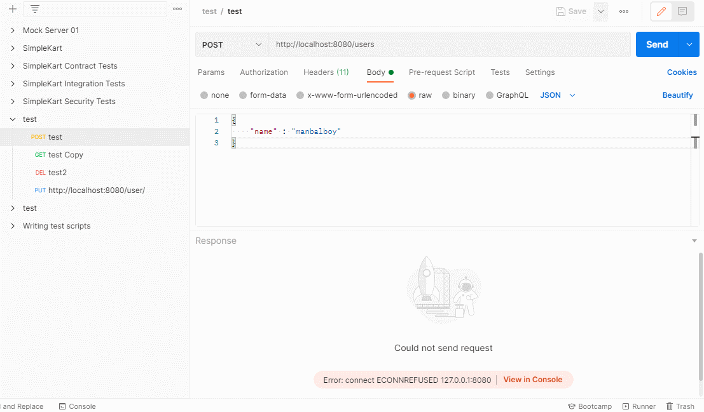

# [NODE] NODE.js의 http module


## 1.개요
NODE에서는 기본적으로 제공 하는 <b style="color:tomato">http</b> 모듈로 손쉽게 간단한 서버를 구축 할 수 있습니다.

JAVA나 타 서버 프로그래밍을 하신 분들이라면 http 규약을 어떻게 활용하여 요청 응답 을 처리하는지는 아실 것이라고 생각합니다. 

이러한 처리들을 손쉽게 구현 할 수 있도록 NODE는 http 모듈을 제공 하고 있는 것 입니다.

## 2.http 모듈로 응답과 요청 구현하기
간단하게 Hello Node를 표현하는 서버를 구현해 보겠습니다. 

```js
// file: "server.js"
const http = require('http');

http.createServer((req, res) => {
    res.writeHead(200, {'Content-Type' :'text/html; charset=utf-8'});
    res.write('<h1>Hello Node~!</h1>');
    res.end();
}).listen(8080, () => {
    console.log("connect 8080 port")
});
```

위의 소스 코드를 살펴보면 http 모듈을 이용해 createServer 를 한후 8080 port에 매핑을해서 서버를 구동한다는 것을 어렴풋이 알수 있습니다.

아래의 명령어를 통하여 위의 소스 코드를 실행해보세요 
```bash
 $ node server.js
```

위의 명령어를 입력후 http://localhost:8080 으로 접속하면 다음과 같은 화면이 나오면 성공입니다. 


위의 예제 소스에서 req와 res는 각각 request 객체와 , respons 객체입니다.

request 객체는 브라우저에서 요청한 값들을 나타내며 respons 객체는 서버가 브라우저에게 응답하는 정보가 담겨있는 객체입니다.

또한 http 모듈과 fs모듈을 혼합하여 정적자원을 서빙할수 있습니다. 

```js
// file: "server2.js"
const http = require('http');
const fs = require('fs').promises;

http.createServer(async (req, res) => {
    try {
        const data = await fs.readFile('./server2.html')
        res.writeHead(200, {'Content-Type' :'text/html; charset=utf-8'});
        res.end(data);
    } catch (e) {
        console.error(e);
        res.writeHead(500, {'Content-Type' :'text/plain; charset=utf-8'});
        res.end(e.message);
    }
}).listen(8080, () => {
    console.log("connect 8080 port")
});
```

```html
<!-- file: "server2.html" -->
<!DOCTYPE html>
<html lang="en">
<head>
    <meta charset="UTF-8">
    <meta http-equiv="X-UA-Compatible" content="IE=edge">
    <meta name="viewport" content="width=device-width, initial-scale=1.0">
    <title>Document</title>
</head>
<body>
    서빙용 html
</body>
</html>
```

위의 html 파일과 node 파일을 작성하여 다음 명령어로 실행해 주세요

```bash
 $ node server2.js
```


실행결과는 다음과 같습니다.

정말 노드의 기능만 조금 알면 이렇게 응용을 하여 파일을 읽어 서빙을 할 수 있습니다. 에러처리와 여러가지 생각할 점 이 있다고 해도 그건 NODE 서버만의 문제가 아니기 때문에 제쳐두더라도 메서드 활용법만 알면 간단한 서버가 금방 만들어 사용할 수 있다는 것은 큰 이점이라고 할 수 있습니다. 


## 3.라우팅 사용하기
서버라면 의미있는 url 별로 다른 자원들을 클라이언트에 내려줘야합니다. 

요청이 목적지에 도달하기위해 원하는 주소로 매핑시켜주는 것이 라우팅입니다.

먼저 코드먼저 살펴보겠습니다.


```js
// file: 'routerServer.js'
const http = require('http');
const user = {}; //db대신

http.createServer(async (req, res) => {
    try {
        console.log(req.method, req.url);
        if(req.method === 'GET') {
            if(req.url === '/') {
                res.writeHead(200, {'Content-Type' :'application/json; charset=utf-8'});
                return res.end(JSON.stringify({root : 1}));
            } else if(req.url === '/users') {
                res.writeHead(200, {'Content-Type' :'application/json; charset=utf-8'});
                return res.end(JSON.stringify(user));
            }
        } else if(req.method === 'POST') {
            if(req.url === '/users') {

                let body ='';
                req.on('data' , (data) =>{
                    body += data;
                });

                return req.on('end', ()=>{
                    const {name} = JSON.parse(body);
                    const id = Date.now();
                    user[id] = name;
                    res.writeHead(201);
                    return res.end(JSON.stringify(user));
                })
            }
        } else if(req.method === 'PUT') {
            if(req.url.startsWith('/user/') ) {
                const key = req.url.split('/')[2];
                let body = '';
                req.on('data' , (data) =>{
                    body += data;
                });

                return req.on('end', ()=>{
                    const {name} = JSON.parse(body);
                    user[key] = name;
                    res.writeHead(201);
                    return res.end(JSON.stringify(user));
                })
            }
        } else if(req.method === 'DELETE') {
            if(req.url.startsWith('/user/') ) {
                const key = req.url.split('/')[2];
                delete user[key];

                return res.end(JSON.stringify(user));
            }
        }

        res.writeHead(404);
        return res.end(404);
    } catch (err) {
        console.log(err);
        res.writeHead(500);
        return res.end(err);
    }
}).listen(8080, () => {
    console.log("connect 8080 port")
});

```

위의 코드가 너무 복잡하다고 생각하시나요 찬찬히 뜯어보면서 이해 하시면 어렵지 않습니다. 중복되는 코드들도 많고요 이 코드를 실행하고 TEST 하기 위해서 postman 이라는 tool을 사용 하였습니다.

```bash
 $ node routerServer.js
```

위의 결과는 다음과 같습니다.



모바일에서는 gif 파일이 해상도가 낮아 잘 안보이실 수 있지만 post, get, delete, put 모두 정상 작동 하는 것을 알 수 있습니다. 

코드를 보았을때 뭔가 비효율 적이라고 생각 하실 수 있는데 걱정마세요 express 라는 라이브러리를 이용하면 보다 효율적이고 안정적인 서버 구축이 가능합니다. 

## 4.정리 
http 모듈을 사용하여 간단한 서버 구축을 해보았는데요 이게 뭐야 이런 부분도 존재 할 수 있지만. 근본이기 때문에 구현을 해보시는 것을 추천 드립니다. 

## 5.참고문헌
- NODE.js 교과서 (조현영 저)
- 한권으로 끝내는 NODE & Express 2판 (이선브라운 저)

