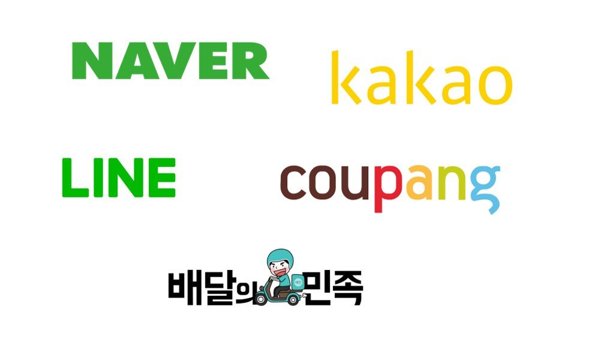

# team. nklcb의 첫 study node.js 리파지토리입니다.

## 1. 구성원
 - [정훈(manbalboy)](https://github.com/manbalboy)
 - [김선중(sunjoong91)](https://github.com/sunjoong91)

## 2. Study 목적 
네카라쿠배 가서 살아남을 수 있는 기초 베이스 쌓기와 역량강화
### 2-1.가고싶다 네카라쿠배 !
하다보면 언젠간 가겠지.. 우리는 신입이 아니니까... 기업이 필요로 하는 역량을 익히고 코딩테스트 봐서 입사하자. 현재 모집요강의 필요 스킬은 아래와 같다. 

### 2-2.frontEnd 필수역량
- Node.js
- ES6 +
- Html
- Css
- Vue
- React
- Webpack
- http
- Type script
- React Native
- Jest
- 알고리즘 코딩테스트 대비

참고 : [프론트엔드 로드맵](./assets/images/frontend.png)

### 2-3.목표 
필수역량중 한해에 분기별로 1과목씩 학습을 목표로한다. 

## 3.Study 규칙
### 3-1. 마음가짐
- 우리는 언젠간 네카라쿠배에 들어갈수 있다는 마인드를 가진다 그들은 외계인이아니다.
- 우리는 직업이 있고 가족이 있다. 내가 활용할 수 있는 리소스에 대해서 보수적으로 접근하여 문서를 작성하자
- 나 > 본업 > 스터디 가 우선순위 이다. 
- '내가 이런것도 공부 했어'가 아닌 '이렇게작성되었구나 이제 알고 쓰자' 를 목표로 하자.
- 산출물은 public 하게 공개되므로 스스로 만족할 수 있는 수준으로 정하자 

### 3-2. 스터디시간
- 비대면 스터디를 원칙으로 하며 GoogleMeet 또는 Teams 를 통하여 수요일 10시~11시에 진행을 원칙으로 한다. 30분 미만으로 해당 담당자는 리뷰를 준비하고 30분간 질의응답및 향후 계획을 논의한다.
- 스터디에 참여할수 없다면 이유를 불문하고 issue에 스터디에 필요한 부분이나 고칠점을 1개 등록한다. 
- 스터디 미참석이나 마이크를 할수 없을경우 미리 사전에 공지한다.

### 3-3. 공부의 흥미가 없다면?
- 스터디 구성원들에게 말하고 스터디 팀을 탈퇴하면 된다. 

## 4.Study 진행방식
- 스터디는 앞서 말한것과 같이 매주 수요일 10 ~ 11시 까지 진행한다.
- Google Meet/ Teams 를 활용해 비대면으로 진행한다.
- 산출물은 해당 장을 요약하여 markdown 포맷으로 작성한뒤 pull request로 올린다.
- 산출물은 매주 각자 작성하여 [해당 주제]/[ID] 및에 작성한다.
- 매주 한명씩 스터디 리뷰어가 되며 30분간 리뷰한다. 잘된점/못된점/잘 모르겠다.등등
- 각각 올라온 MD 파일을 확인후 좀더 보안할점들을 이야기한후 좋은 예제나 정보들을 모아 1개의 요약본을 만든다. 이때 요약본 담당자는 그주의 리뷰어이다.
- MD파일은 수요일 오후 7시까지 올린다.

## 5.참고자료
Pull Request 하는법 : [https://manbalboy.github.io/blog/etc/2021-04-26-git01/](https://manbalboy.github.io/blog/etc/2021-04-26-git01/)
